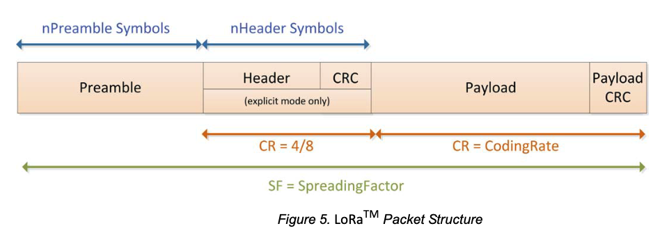

# Wireless transmission diagrams and definitions

The wireless transmission data will be defined in the following document regarding the ROSALIA rev.2 PCB. It will be divided into two separate categories:
1. LoRa
2. BLE

## LoRa data transmission

The wireless communication with LoRa is based on RFM95w IC with SPI communication between the MCU. It will be two-sided with:
- The ROSALIA being a "slave" in the sense of it getting data with commands asynchronously from a foreign source (GS) and periodically sending data through a predefined data frame (?)
- GS being a "master" in the sense of it being in control of the ROSALIA device actions. It will be able to send commands to take the ROSALIA to different states, perform resets of its slave devices etc.
// (TODO add info what is a slave and what is a master in the system_overview doc)

### RFM95w overview

To fully understand how the communication will take place, we will first need to look at the RFM95w features and how it operates. For more closure look at the [RFM95w datasheet](../Related_IC_datasheets/RFM95_96_97_98W.pdf). The radio itself operates in the 868MHz band.

The packet consists of Preamble, (optional, but used) Header and Header CRC, data Payload and Payload CRC. Thankfully, due to the application provided directly in the IC, only the Payload will be sent through SPI communication to the MCU. Due to the built-in CRC calculation, it will also not be needed to calculate the Payload CRC by ROSALIA.

### GS commands

We will start with a list of available commands that can be sent from GS to ROSALIA. The command data packet will have a predefined frame as shown below:

0x693B SUDO 0x3B COMMAND AND (OPTIONAL) VALUES  0x693B
"i; SUDO ; COMMAND AND (OPTIONAL) VALUES i;"

Where the top part shows the packet in HEX and bottom in string configuration defined in ASCII. 

__COMMAND__ is a 16 bit unsigned int from a list defined further in the document. __Optional values__ are some variables of unprecised length that can be sent with the command, and are also defined with commands in the table below

__SUDO__ is an optional argument that can force ROSALIA to take action, even if it should be prohibited by software

Parts in __RED__ are hardset and are supposed to filter out junk and wrong commands, if there are other transmitters nearby not supposed to interfere with the ROSALIA system.

#### Command definitions:

| GS COMMAND | HEX definition | Ascii definition | Optional values |
| --- | --- | --- | --- |
| TURN OFF ROSALIA | | |
