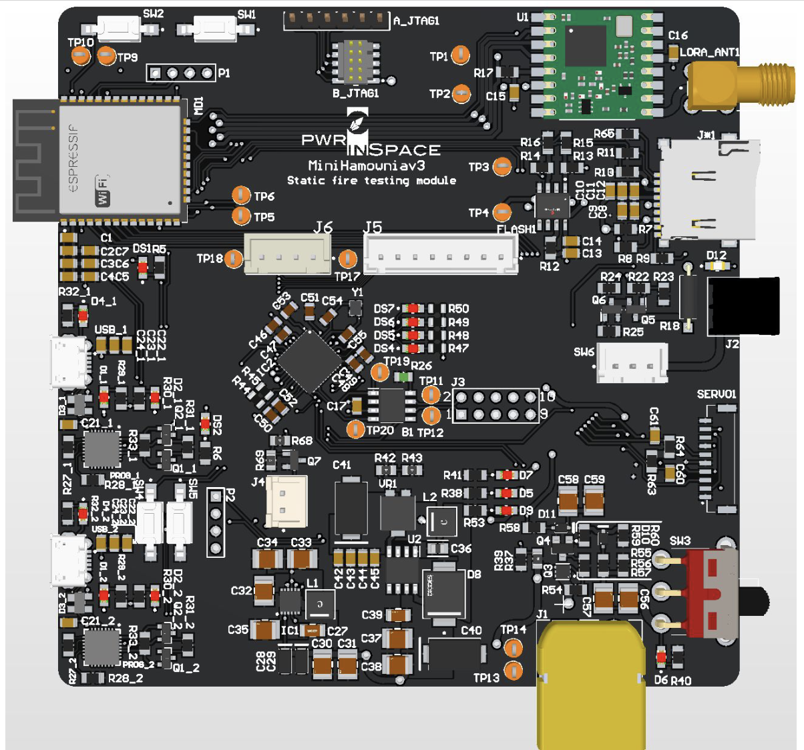

# ROSALIA MainBoard

## Rocket Static Fire stand for Advanced Launch and Integration of Aerospace Instruments

### Software

Using [ESP-IDF v5.0.1](https://docs.espressif.com/projects/esp-idf/en/v5.0/esp32/).

Developed software:
- RFM95w LoRa library
- SD Card support
- External and internal flash memories
- Can transceiver (Planned)
- BLE with OTA capabilities (Planned)

### Hardware mainboard

The mainboard features:
- ESP32 microcontroller
    - RFM95w module for LoRa communication
    - SD Card and external flash memories
    - 2 servo controllers with limit switches
    - BLE support
- ESP32 Pico Microcontroller
    - Power sustain and remote turn-off abilities
    - Buzzer
    - Can transceiver

[Main project soundtrack](https://www.youtube.com/watch?v=jWlaaK7BxeU)