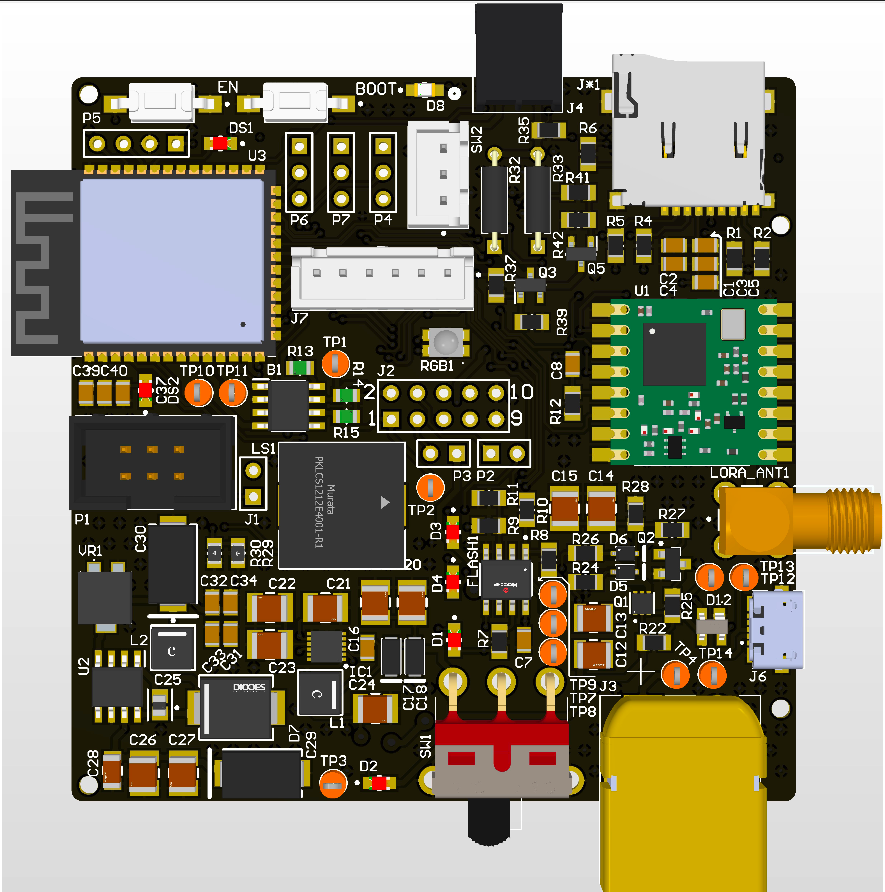
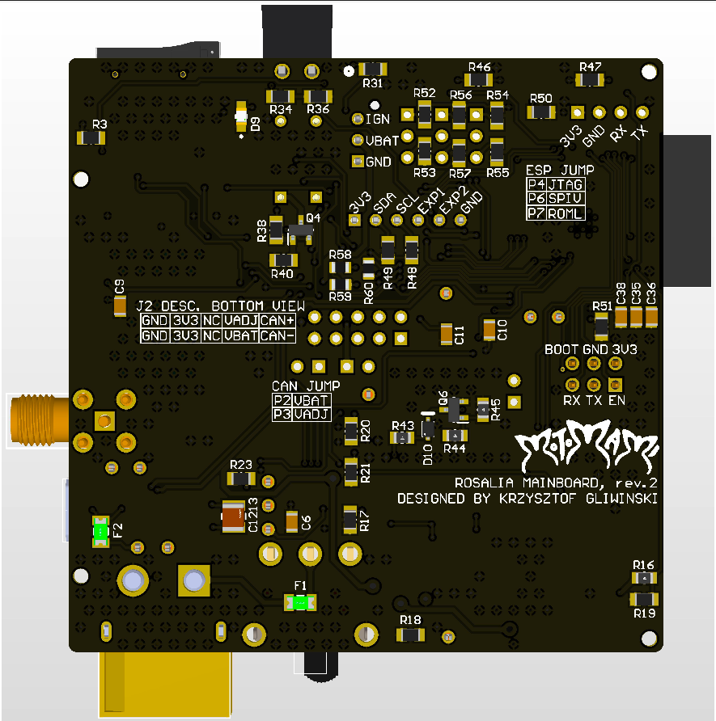

# ROSALIA MainBoard

## Rocket Static Fire stand for Advanced Launch and Integration of Aerospace Instruments

### Software

Using [ESP-IDF v5.0.1](https://docs.espressif.com/projects/esp-idf/en/v5.0/esp32/).

Developed software:
- RFM95w LoRa library
- SD Card support
- External and internal flash memories
- Can transceiver 
- BLE API
- USB OTG/USB MSC

#### Run unit tests

To run unit tests:
```bash
cd Mainboard_ESP32/test
idf.py build
# if build does not work checkout idf.py menuconfig
idf.py flash monitor
# reset the board
```

### Hardware - ROSALIA mainboard rev.2

The mainboard features:
- ESP32S3 microcontroller with BLE support
- RFM95w module for LoRa communication
- SD Card and external flash memories
- 2 servo controllers with limit switches

#### Development board overview

The development board has been designed in Altium Designer. Documentation with schematics can be found in Docs/PCB_Documentation directory

On the images below the 3D renders of ROSALIA rev.2 board are presented




[Main project soundtrack](https://www.youtube.com/watch?v=jWlaaK7BxeU)